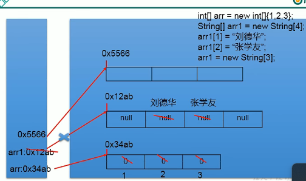
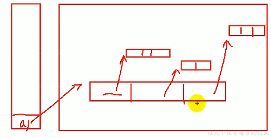

Day09
===

Array
----

* Definition:
  * multiple same data type datas with sequential, use one name and index to locate.
* features:
  * name,index,element,length:
  * sequential
  * referential data type
  * continuous in memory
  * Cannot modify length
* Type:
  * one dimension, two dimensions, three dimensions
  * basic data type array; referential data type array

* Memory:
  * 
    * Heap will storage all referential data
    * stack will storage the value of basic data and the address of referential data
  * 

* One dimensional array:
  * Declare:
  * datatype[] name = new datatype[length]{values}
  * Default Value:
    * int array:0
    * float array: 0.0
    * char array: 0 not '0'
    * referential data array:null
* Two dimensional array:
  * 
  * practise Yanghui triangle
* [Code Example](../Codes/ArrayTest.java)
[Back to Director](https://github.com/WestbrookYuan/Java-Learning/)